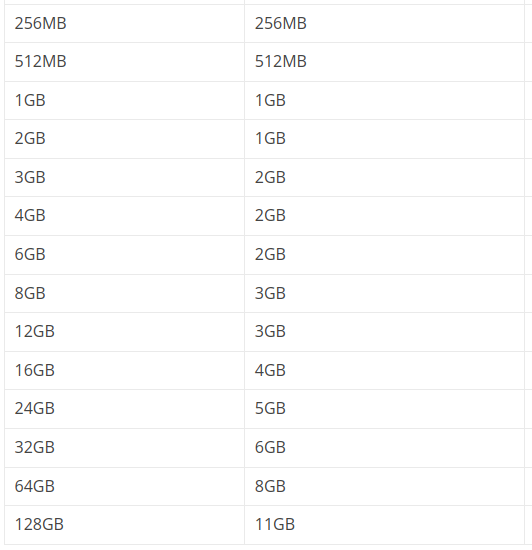

# Install Arch

## After initialize the ISO image

Change font to one more readable, check up the correct EFI initialize.
```bash
setfont ter-132n
ls /sys/firmware/efi/efivars
```

Connect to the Wi-Fi(if you use Wi-Fi).
```bash
iwctl
device list
station $wlan scan
station $wlan get-networks
exit
iwctl --passphrase $password station $wlan connect $ssid
ping www.archlinux.org -c 5
```

Setup the Date&Time.
```bash
timedatectl list-timezones # List of available timezones
timedatectl set-timezone Europe/Moscow # Or Europe/Berlin, btw why not
timedatectl status # Check up
```

## Make the disk partitions
In this moment you can choose `ext4` or `btrfs`. (I give a tip: choose btrfs).

You must know about which size of swap partition you should choose.


If you want know more about your disks and choose the one, where you install the Arch distro.
```bash
lsblk
fdisk -l
cfdisk /dev/$disk
```

### With `ext4`
```bash
# root 
mkfs.ext4 /dev/$root_partition
mount /dev/$root_partition /mnt

# home
mkdir /mnt/home
mkfs.ext4 /dev/$home_partition
mount /dev/$home_partition /mnt/home

# swap
mkswap /dev/$swap_partition
swapon /dev/$swap_partition

# efi
mkfs.fat -F32 /dev/$efi_partition # If you don't use dualboot
mkdir /mnt/efi
mount /dev/$efi_partition /mnt/efi
```

### With `btrfs`
```bash
mkfs.btrfs /dev/$root_partition
mount /dev/$root_partition /mnt

btrfs subvolume create /mnt/@
btrfs subvolume create /mnt/@home
btrfs subvolume create /mnt/@var
btrfs subvolume create /mnt/@opt
btrfs subvolume create /mnt/@tmp
umount /mnt

mount -o noatime,commit=120,compress=zstd,space_cache=v2,subvol=@ /dev/$root_partition /mnt
mkdir /mnt/{home,opt,tmp,var,efi}
mount -o noatime,commit=120,compress=zstd,space_cache=v2,subvol=@home /dev/$root_partition /mnt/home
mount -o noatime,commit=120,compress=zstd,space_cache=v2,subvol=@opt /dev/$root_partition /mnt/opt
mount -o noatime,commit=120,compress=zstd,space_cache=v2,subvol=@tmp /dev/$root_partition /mnt/tmp
mount -o subvol=@var /dev/$root_partition /mnt/var

mkfs.fat -F32 /dev/$efi_partition # If you don't use dualboot
mount /dev/$efi_partition /mnt/efi
```

## Install the system
Before you begin, you should check up the file system.
```bash
lsblk
```

Install the main linux kernel components.
```bash
pacstrap /mnt base base-devel linux linux-firmware linux-headers
```
Install the micro-codecs support.
```bash
pacstrap /mnt intel-ucode iucode-tool # For Intel
pacstrap /mnt amd-ucode iucode-tool # For AMD
```
Install the grub loader components.
```bash
pacstrap /mnt grub efibootmgr os-prober
pacstrap /mnt dosfstools mtools ntfs-3g # For dualboot with Windows Boot Loader
```
Install the `btrfs` support (if you use that).
```bash
pacstrap /mnt btrfs-progs grub-btrfs
```
Install the printers support.
```bash
pacstrap /mnt cups cups-pdf
```
Install the laptop battery packages.
```bash
pacstrap /mnt tlp tlp-rdw powertop acpi acpi-call
```
Install the system packages.
```bash
pacstrap /mnt iw wpa_supplicant networkmanager network-manager-applet acpid dialog dhcpcd
```
Install the MUST-HAVE utils.
```bash
pacstrap /mnt sudo curl wget git neofetch lshw which reflector rsync ccache openssh unzip
```
Install the terminal(TUI) apps.
```bash
pacstrap /mnt neovim tmux fish htop ranger fzf ripgrep
```

### Enter the system
Save the yours file system partitions.
```bash
genfstab -U /mnt >> /mnt/etc/fstab
cat /mnt/etc/fstab
```

And after this, you can enter the yours system.
```bash
arch-chroot /mnt
```

## Setup after installation

### Install dotfiles
```bash
git clone https://www.github.com/ArtLkv/artlkv-dotfiles.git ~/Downloads/dotfiles
```

### Setup locales.
```bash
loadkeys /usr/share/kbd/keymaps/i386/qwerty/ru.map.gz
sudo echo 'KEYMAP=ru' >> /etc/vconsole.conf

nvim /etc/locale.gen # And uncomment the en_US.UTF-8 and ru_RU.UTF-8
local-gen
sudo cp ~/Downloads/dotfiles/etc/locale.conf /etc/locale.conf
ln -sf /usr/share/zoneinfo/Europe/Moscow /etc/localtime
hwclock --systohc
```

### Create the main user.
```bash
passwd # Change password to the root user(I give a tip: use the one password for root and main user).
useradd -m -g users -G wheel,storage,power,audio -s /bin/fish $username
passwd $username # Change password to the main user

EDITOR=nvim visudo # And uncomment the `%wheel ALL=(ALL:ALL) ALL`
echo '$username' > /etc/hostname
nvim /etc/hosts
```

In file `/etc/hosts`.
```bash
127.0.0.1   localhost.localdomain   localhost
::1         localhost.localdomain   localhost
127.0.0.1   $username.localdomain   $username
```

### Setup the boot loader
```bash
nvim /etc/mkinitcpio.conf # And add to MODULES the btrfs
nvim /etc/default/grub # And uncomment the GRUB_DISABLE_OS_PROBER=false

mkinitcpio -P linux
grub-install --target=x86_64-efi --efi-directory=/efi --bootload-id=ARCH --recheck
grub-mkconfig -o /boot/grub/grub.cfg
```

### Enable the services
```bash
systemctl enable NetworkManager.service
systemctl enable sshd
systemctl enadle dhcpcd
systemctl enable acpid
systemctl enable reflector.timer
systemctl enable fstrim.timer
systemctl enable cups.service
systemctl enable tlp.service
systemctl enable tlp-sleep

systemctl mask systemd-rfkill.service
systemctl mask systemd-rfkill.socket
```

### Reboot the system
```bash
exit
umount -lR /mnt
reboot
```

## Setup after reboot

### Connect to the Wi-Fi(Yes, again, but with different util now)
```bash
sudo nmcli dev wifi connect $ssid password $password
ping www.archlinux.org -c 5
```

### Create the user folders
```bash
mkdir ~/Downloads
mkdir ~/Documents
mkdir ~/Pictures
mkdir ~/Videos
mkdir ~/Music
```

### Setup the package manager
```bash
sudo nvim /etc/pacman.conf # And uncomment the [multilib] block, and uncomment the Color option, and add below ILoveCandy option
sudo reflector --verbose --country 'Russia' --latest 5 --sort rate --save /etc/pacman.d/mirrorlist # You can use it without country flag
sudo nvim /etc/pacman.d/mirrorlist # And add the mirror.yandex.ru/archlinux/$repo/os/$arch
sudo pacman -Suy
cd ~/Downloads
sudo pacman -S --needed git base-devel
git clone https://aur.archlinux.org/yay.git
cd yay
makepkg -si
```

### Setup the fonts
```bash
yay -S ttf-dejavu noto-fonts gnu-free-fonts ttf-freefont ttf-ubuntu-font-family
yay -S ttf-liberation ttf-droid ttf-roboto terminus-font
yay -S ttf-jetbrains-mono-nerd ttf-hack-nerd
```

If you use the dualboot with Windows.
```bash
sudo mkdir /mnt/windows
sudo ntfs-3g /dev/$windows_partition /mnt/windows
mkdir ~/Downloads/WindowsFonts
cp /mnt/windows/Windows/Fonts/*.tt* ~/Downloads/WindowsFonts
sudo mkdir /usr/share/fonts/WindowsFonts/
sudo cp ~/Downloads/WindowsFonts/* /usr/share/fonts/WindowsFonts/
sudo chmod 644 /usr/share/fonts/WindowsFonts/*
fc-cache --force
umount /mnt/windows
rm -rf /mnt/windows
```

## Install and configure the drivers

### Video adapter(Nvidia)

If you use the new Nvidia graphic cards.
```bash
yay -S nvidia-dkms nvidia-utils nvidia-settings opencl-nvidia vulkan-icd-loader
yay -S lib32-nvidia-utils lib32-opecl-nvidia lib32-vulkan-icd-loader
```

If you use the 390 series Nvidia graphic cards.
```bash
yay -S nvidia-390xx nvidia-390xx-settings nvidia-390xx-utils opencl-nvidia-390xx vulkan-icd-loader
yay -S lib32-nvidia-390xx-utils lib32-opencl-nvidia-390xx libxnvctrl-390xx lib32-vulkan-icd-loader
```
Configure the system initialization.
```bash
sudo nvim /etc/mkinitcpio.conf # And add to MODULES the nvidia, nvidia_modeset nvidia_uvm nvidia_drm
sudo nvim /etc/default/grub # And change GRUB_CMDLINE_LINUX value to the nvidia_drm.modeset=1

sudo mkdir /etc/pacman.d/hooks
sudo cp ~/Downloads/dotfiles/etc/pacman.d/hooks/nvidia.hook /etc/pacman.d/hooks/nvidia.hook
sudo nvidia-xconfig
sudo mv /etc/X11/xorg.conf /etc/X11/xorg.conf.d/20-nvidia.conf

cd ~/Downloads
git clone https://aur.archlinux.org/nvidia-tweaks.git
cd nvidia-tweaks
makepkg -sric
```
Reboot.
```bash
sudo mkinitcpio -P
sudo grub-mkconfig -o /boot/grub/grub.cfg
sudo reboot
sudo systemctl enable nvidia-persistenced.service
```

### Video adapter(AMD Radeon)
```bash
yay -S mesa mesa-vdpau vulkan-radeon glu vulkan-icd-loader xf86-video-amdgpu
yay -S lib32-mesa lib32-mesa-vdpau lib32-vulkan-radeon lib32-glu lib32-vulkan-icd-loader
```

Configure the system initialization.
```bash
sudo nvim /etc/mkinitcpio.conf # And add to MODULES the amdgpu, radeon
sudo nvim /etc/default/grub # And change GRUB_CMDLINE_LINUX value to the...
# radeon.cik_support=0 amdgpu.cik_support=1 For Sea Islands
# radeon.si_support=0 amdgpu.si_support=1 For Southern Islands
```

Create the X11 conf.
```bash
sudo cp ~/Downloads/dotfiles/etc/X11/xorg.conf.d/20-amdgpu.conf /etc/X11/xorg.conf.d/20-amdgpu.conf
```

Reboot.
```bash
sudo mkinitcpio -P
sudo grub-mkconfig -o /boot/grub/grub.cfg
reboot
```

### Keyboard
```bash
sudo cp ~/Downloads/dotfiles/etc/X11/xorg.conf.d/00-keyboard/conf /etc/X11/xorg.conf.d/00-keyboard.conf
```

### TP-LINK Wireless USB Adapter
```bash
cd ~/Downloads
git clone https://aur.archlinux.org/rtl88xxau-aircrack-dkms-git.git
cd rtl88xxau-aircrack-dkms-git
makepkg -s
yay -U rtl88xxau-aircrack-dkms-git-*.pkg.tar.zst
```

### Bluetooth and audio card
```bash
yay -S bluez bluez-utils blueman
yay -S alsa-utils alsa-plugins
yay -S pipewire pipewire-alsa pipewire-pulse pipewire-jack wireplumber pavucontrol
yay -S lib32-pipewire lib32-pipewire-jack

sudo mkdir -p ~/.config/pipewire/pipewire.conf
sudo cp /usr/share/pipewire/*.conf ~/.config/pipewire
sudo nvim ~/.config/pipewire/pipewire.conf # And change default.clock.allowed-rates value to the [44100 48000]

sudo systemctl --user enable pipewire.service
sudo systemctl --user enable pipewire-pulse.service
sudo systemctl enable bluetooth.service
```

